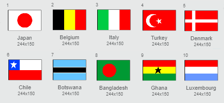

## Draw the flags

+ Open the starter project.

--- collapse ---
---
title: I'm using Scratch online
---

+ Open the 'Guess the flag' Scratch starter project at [jumpto.cc/flags-go](http://jumpto.cc/flags-go){:target="_blank"}.

+ If you have a Scratch account, you can click on **Remix** in the top right-hand corner to save a copy of the project to your account

--- /collapse ---

--- collapse ---
---
title: I'm using Scratch offline
---

Download the [flags.sb2](resources/flags.sb2){:target="_blank"} Scratch starter project and open it using the offline editor.

--- /collapse ---

+ Click on the flag sprite and then click on the **Costumes** tab. You will see a blank flag template. Create nine duplicate costumes of the blank flag template, so you have ten flags in total.

[[[generic-scratch-duplicate-costumes]]]

+ Now we will draw the flags. Click on the first costume and add the name of a country as the costume's name.

+ Use the **vector drawing tools** to draw that country's flag. Make sure your drawing is exactly the same size as the flag template.

[[[generic-scratch-vector-mode]]]

For example, you can draw the flag for Italy by drawing three equally sized rectangles using the rectangle tool. Position them using the selection tool.

You could easily create a similar flag by duplicating this costume and then changing the colours. For example, to draw the flag for Belgium, duplicate the costume designed to look like the the Italian flag, and use the fill bucket tool to fill each rectangle with a different colour.

+ Draw another nine flags so that you have exactly ten different flag costumes in total. Make sure that the name of each costume is the name of the flag's country.

Here are the costumes we chose, but you can choose any flags you like for your game.

